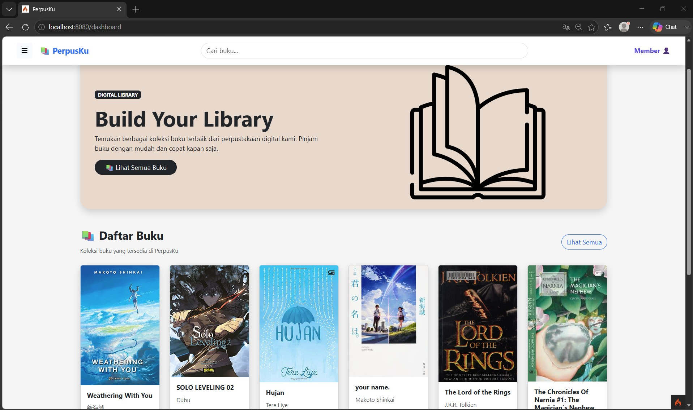
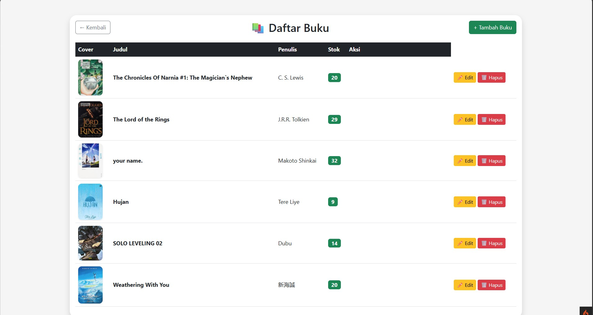
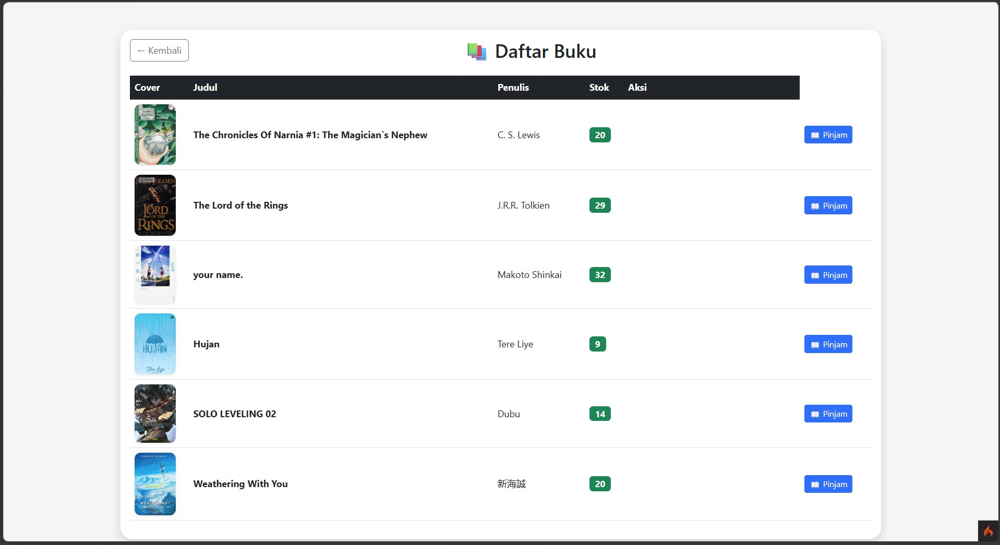
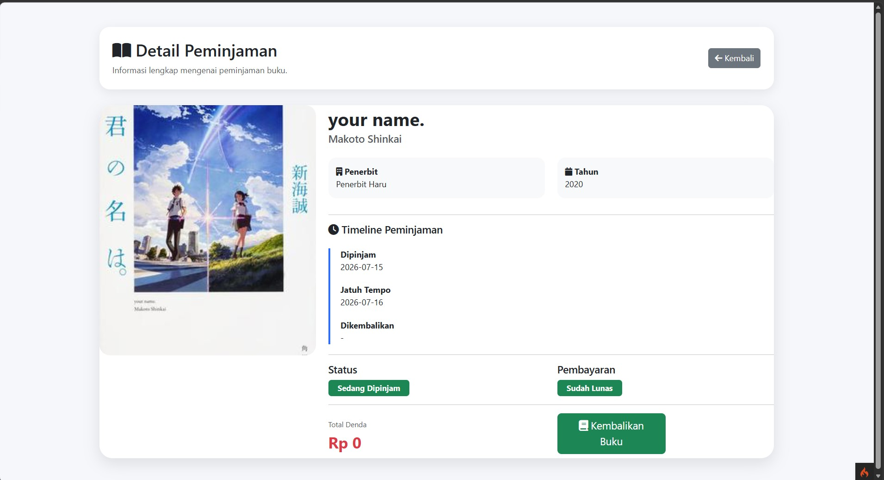
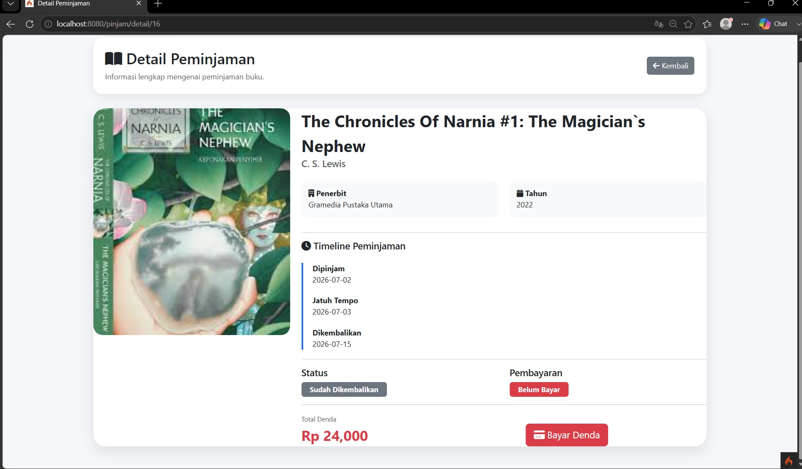

# 📚 Sistem Informasi Perpustakaan Digital

Sistem Informasi Perpustakaan Digital adalah aplikasi berbasis web yang dibangun menggunakan **CodeIgniter 4** untuk membantu proses pengelolaan perpustakaan secara digital. Aplikasi ini menyediakan fitur manajemen buku, peminjaman dan pengembalian buku, perhitungan denda otomatis, pembayaran denda melalui **Midtrans Sandbox**, notifikasi **WhatsApp (WAHA API)**, serta integrasi **Open Library API** untuk mengambil data buku secara otomatis.


## 🏠 Dashboard
*Tampilkan screenshot dashboard di sini.*



## 📚 Manajemen Buku


## 📖 Peminjaman Buku


## 🔄 Pengembalian Buku


## 💳 Pembayaran Denda (Midtrans Sandbox)



# ✨ Fitur Utama

- Login Multi User (Admin & Member)
- Dashboard Admin dan Member
- CRUD Data Buku
- CRUD Staff
- CRUD User
- Peminjaman Buku
- Pengembalian Buku
- Perhitungan Denda Otomatis
- Pembayaran Denda Online menggunakan Midtrans Sandbox
- Notifikasi WhatsApp menggunakan WAHA API
- Integrasi Open Library API
- REST API Buku
- Upload Cover Buku

---

# 🛠 Persyaratan Sistem

Pastikan perangkat Anda memenuhi persyaratan berikut:

- PHP 8.2 atau lebih baru
- MySQL / MariaDB
- Composer
- CodeIgniter 4
- XAMPP / Laragon
- Git
- Ekstensi PHP:
  - intl
  - curl
  - mbstring
  - mysqli
  - openssl
  - json

---

# 🚀 Cara Instalasi

## 1. Clone Repository

```bash
git clone https://github.com/USERNAME/NAMA_REPOSITORY.git
cd NAMA_REPOSITORY
```

Ganti **USERNAME** dan **NAMA_REPOSITORY** sesuai repository GitHub Anda.

---

## 2. Install Dependency

```bash
composer install
```

---

## 3. Konfigurasi Environment

Salin file

```
.env
```

menjadi

```
.env.example
```

Kemudian ubah konfigurasi berikut.

```ini
CI_ENVIRONMENT = development

app.baseURL = 'http://localhost:8080/'

database.default.hostname = localhost
database.default.database = perpustakaan
database.default.username = root
database.default.password =
database.default.DBDriver = MySQLi

# Midtrans Sandbox
MIDTRANS_SERVER_KEY=Masukkan_Server_Key
MIDTRANS_CLIENT_KEY=Masukkan_Client_Key
MIDTRANS_IS_PRODUCTION=false

# WAHA API
WAHA_BASE_URL=http://localhost:3000
WAHA_API_KEY=Masukkan_API_Key
WAHA_SESSION=default
```

---

## 4. Setup Database

Buat database baru dengan nama

```
perpustakaan
```

Kemudian jalankan migration dan seeder

```bash
php spark migrate --seed
```

atau apabila menggunakan seeder tertentu

```bash
php spark migrate
php spark db:seed UserSeeder
```

---

## 5. Jalankan Aplikasi

```bash
php spark serve
```

Kemudian buka browser

```
http://localhost:8080
```

---

# 🔐 Akun Demo

## 👨‍💼 Admin

```
Username : admin
Password : admin123
```

---

## 👤 Member

```
Username : member
Password : member123

atau

Username : taufik
Password : taufik123
```

> Sesuaikan kembali apabila username dan password pada Seeder Anda berbeda.

---

# 📂 Struktur Project

```
app
 ├── Config
 ├── Controllers
 ├── Database
 │   ├── Migrations
 │   └── Seeds
 ├── Filters
 ├── Libraries
 ├── Models
 └── Views

public
vendor
writable
```

---

# 🔌 API & Integrasi

## Midtrans Sandbox

Digunakan untuk pembayaran denda perpustakaan secara online.

Fitur:

- Generate Snap Token
- Pembayaran Online
- Callback Notification
- Update Status Pembayaran Otomatis

---

## WAHA API

Digunakan untuk mengirim notifikasi WhatsApp secara otomatis.

Notifikasi yang dikirim:

- Konfirmasi Peminjaman Buku
- Konfirmasi Pembayaran Denda

---

## Open Library API

Digunakan untuk mengambil data buku secara otomatis berdasarkan ISBN.

---

# 🧰 Teknologi yang Digunakan

- CodeIgniter 4
- PHP 8
- MySQL
- Bootstrap 5
- JavaScript
- Midtrans Sandbox
- WAHA API
- Open Library API
- Composer

---
